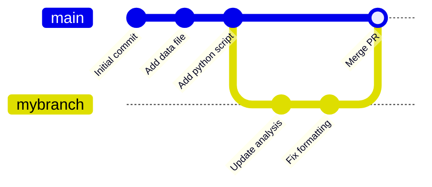

# GitHub Workflow -- Sales Data Analytics

This project is a hands-on exercise for learning **Git** and **GitHub workflows** using a simple Python data analytics script.

## Git Concepts

Git is a **distributed version control system** that tracks the history of changes as people collaborate on projects. Unlike centralized systems, every developer has a complete copy of the project and its history on their own machine.

For more details, see the [official GitHub docs on Git](https://docs.github.com/en/get-started/using-git/about-git).

### Repository

A **repository** (or "repo") is the entire collection of files and folders in a project, along with each file's revision history. This project is a repository.

### Clone

A **clone** is a local copy of a repository that already exists remotely (on GitHub). Cloning downloads all files, history, and branches so you can work on the project locally.

```bash
git clone https://github.com/Etown-Data-Analytics/github-workflow.git
```
### Branch

A **branch** lets you work on changes without affecting the main codebase. You can create a branch, make commits on it, and merge it back when your work is ready.

```bash
git checkout -b mybranch
# make changes, then commit..
```



### Commit

A **commit** is a snapshot of your changes. Think of it like taking a photo of your project at a specific point in time. Each commit is saved in the project's history so you can always go back.

```bash
git add analyze_sales.py
git commit -m "Add daily revenue breakdown"
```

### Fork

A **fork** is a personal copy of someone else's repository under your own GitHub account. You can make changes in your fork without affecting the original project.


### Pull Request

A **pull request** (PR) is how you propose changes from your branch (or fork) back to the main project. Other team members can review your changes, leave comments, and approve them before they are merged.

## Workflow Summary

1. **Clone** the repo (or **fork** it first if you don't have write access)
2. Create a **branch** for your work
3. Make changes and **commit** them
4. Push your branch to GitHub
5. Open a **pull request** for review
6. After approval, **merge** your changes into `main`

## Project Structure

```
github-workflow/
├── data/
│   └── sales_data.csv      # Sample sales data
├── analyze_sales.py         # Main analysis script
├── requirements.txt         # Python dependencies
├── .gitignore
└── README.md
```

## Getting Started

1. **Clone the repository:**
   ```bash
   git clone https://github.com/Etown-Data-Analytics/github-workflow.git
   cd github-workflow
   ```

2. **Create a virtual environment (recommended):**
   ```bash
   python -m venv venv
   source venv/bin/activate  # On Windows: venv\Scripts\activate
   ```

3. **Install dependencies:**
   ```bash
   pip install -r requirements.txt
   ```

4. **Run the analysis:**
   ```bash
   python analyze_sales.py
   ```

## What the Script Does

The script reads `data/sales_data.csv` and prints:

- **Summary** -- total revenue, transaction count, items sold, average transaction value
- **Revenue by Category** -- which product categories earn the most
- **Top 5 Products** -- highest-revenue individual products
- **Daily Revenue** -- revenue broken down by date
